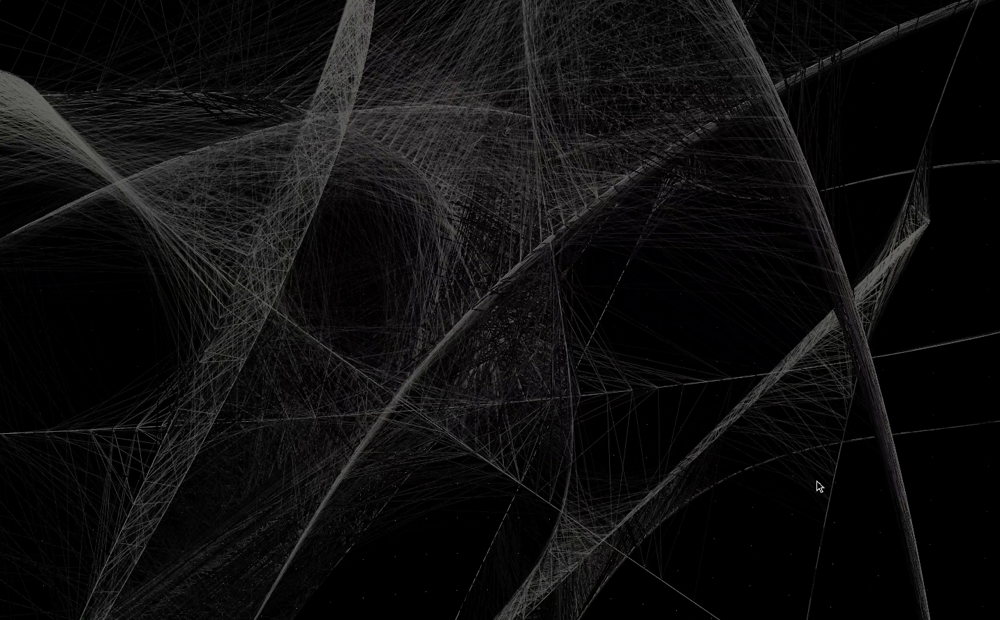

# TraceSphere 💫

A generative visualization that traces particles over a spherical surface in 3D space - built using openFrameworks. 
Inspired by particle systems and geometric motion, this project explores visual expression through motion and persistence.

## Demo 📷

## Usage 🚀

1. Clone or download this repository and place it under openFrameworks/apps/myApps/.

2. Use the projectGenerator to set up the project.

3. Build and run the project.

4. Control the camera with your mouse to explore the trails drawn over the spherical surface.

## Features 📦

- Particles that move over a spherical surface
- Persistent trail rendering
- Interactive 3D camera view
- Frame rate-stabilized update control

## Inspiration 💡

This project is inspired by natural traces of motion — such as the paths of particles, celestial bodies, or wind. 
It combines geometric motion and generative aesthetics using openFrameworks' 3D capabilities to create a visually experimental piece.

## Built With 🔧

- openFrameworks — C++ creative coding toolkit
- Core components used: ofEasyCam, ofVboMesh, ofPolyline, etc.

---

hope the world is beautiful and accelerating.  
by **Urabexon**